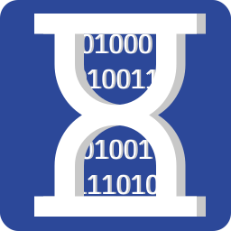

<div align="center">
    
    <h1>BitClock</h1>
</div>

BitClock is a ledger-free distributed timestamp system. You can issue timestamps without relying on centralized servers or large-scale blockchains. By each node generate and share stamps and compile them as proof, we can verify the order in which the data was generated.

[](LICENSE)

> [!NOTE]
> BitClock is currently in active development.

## Documents
[About the algorithm (Not finished yet)](docs/algorithm.md)
## :rocket: Set up
```bash
# Clone the repository (or Download ZIP)
git clone https://github.com/kotagit75/bitclock.git

# Navigate to the project directory
cd Bit-Clock

# Install packages
npm install
```

## :gear: Usage
```bash
# run
npm start

# get status
curl http://localhost:8080/status

# get address
curl http://localhost:8080/address

# get pool
curl http://localhost:8080/pool

# get peers
curl http://localhost:8080/peers

# add peer
curl -X POST -H "Content-Type: application/json" -d '{"url":"http://[peerIP]:3000/"}' http://localhost:8080/addPeer

# proof
curl -X POST -H "Content-Type: application/json" -d '{"data":"Some data"}' http://localhost:8080/proof
```

## License
[BitClock is under the MIT License.](LICENSE)